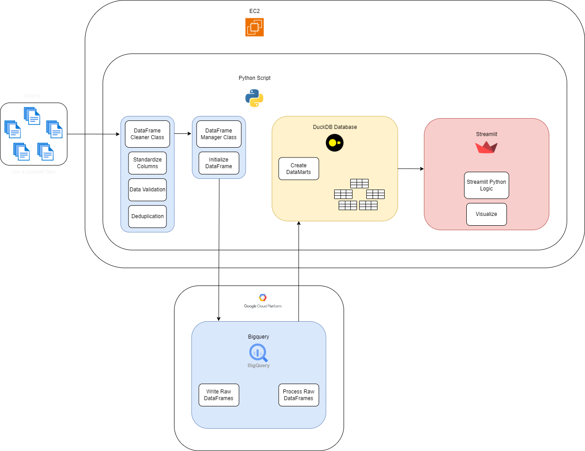

# blood-donation-pipeline-v2
Recently I've been more into the software development best practices, and In the second version I've significantly improved the overall readability of the codebase by implementing classes, abstracting & encapsulating a significant amount logic away from the main python file into its class & methods.

~~In this second interation I've built a more monolithic architecture, in which all infrastructure, tools & code resides in the virtual machine, as opposed to a more 'microservice' approach in the first iteration of the project.~~

In the third iteration (bigquery branch), I've split up the any logic that processes ds_data_granular (the largest dataset, few million rows last i recalled) to bigquery, as filtering over a million rows in a tiny machine (2 core 1gb ram) in streamlit. I've setup a datamart style setup, where raw tables are processed in bigquery, and the smaller machine will filter from this significantly smaller result set.

---
### Workflow

# Notes
Performance could be further improved by optimizing transformations to use Polars instead of DuckDB & Pandas based on benchmarks: 
- https://h2oai.github.io/db-benchmark/

note to self:
src/dataframe*.py could be refactored more to adhere more closely to SOLID principles. 